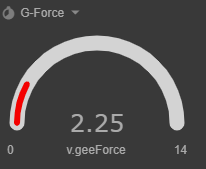

# Telemetry Gauge View
Percentage based views for live floating point telemetry data.

## Usage
Create a new object of type `Gauge` or `Progress Bar`. You can optionally choose a min and max-value of the expected telemetry. If none is chosen the default min and max values are based on normalized percentages (0-1). Edit the object and drag onto the object's view any telemetry objects that you wish to observe.




## Installation
If you are using my [OpenMCT Template](https://github.com/qkmaxware/openmct-template.git) simply clone this repo into `./plugins/openmct-gauge` and add the following config to the server's package.json.
```diff
  "plugins": {
+    "gauge": {
+      "client": "plugins/openmct-gauge/plugin.js"
+    }
  },
```

If you are using a different installation of OpenMCT, first, include the plugin.js file into the index.html and install it the traditional way.
```diff
<!DOCTYPE html>
<html>
<head>
    <meta charset="utf-8">
    <meta name="viewport" content="width=device-width, initial-scale=1.0, maximum-scale=1.0, user-scalable=0, shrink-to-fit=no">
    <meta name="apple-mobile-web-app-capable" content="yes">
    <title><%= name %> - <%= version %></title>
    <script src="openmct/openmct.js"></script>
    <link rel="icon" type="image/png" href="openmct/favicons/favicon-96x96.png" sizes="96x96" type="image/x-icon">
    <link rel="icon" type="image/png" href="openmct/favicons/favicon-32x32.png" sizes="32x32" type="image/x-icon">
    <link rel="icon" type="image/png" href="openmct/favicons/favicon-16x16.png" sizes="16x16" type="image/x-icon">

    <script src="static/lib/http.js"></script>
+    <script src="plugins/openmct-gauge/plugin.js"></script>
</head>
<body>
    <script>
    ...
+    openmct.install(gauge());

    openmct.start();
    </script>
</body>
```